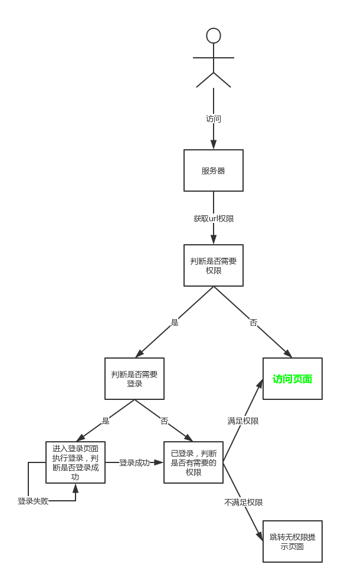

# 权限框架
### 说明
这个demo是我对权限框架的一点理解，然后自己去实现的一个小的权限系统，不是很复杂，仅仅刚刚好实现功能  
### 实现过程
用户通过url请求到服务器，服务器通过过滤器对url进行拦截。拦截url后，系统会对url进行权限查询操作，来识别url需要的权限匹配类型（不需要权限，需要满足至少一个权限，需要满足所有权限）和具体的权限，然后根据权限的匹配类型对用户进行权限匹配。没有权限的url可以随意访问。url有权限需要的话就需要用户登录。用户登录后去查找用户具有的权限。然后根据权限匹配规则的不同，进行不同逻辑的匹配。有一个权限满足便可以放行的类型意味着用户只要有url需要的所有权限中的一条就可以放行，另外一种就是必须全部满足才可以允许通过。这种要求用户具有url所需要的全部权限才可以放行。一般都是用满足1条权限即可。具体的流程图如下  
  
### 表设计
表设计的时候只考虑需要的部分，其他的东西可以根据具体需求的不同灵活的实现。比如用户可能还有phone,address之类的，可以修改这个表，也可以额外的去处理，比如多一张userdtl表和一张user_userdtl关联表来尽可能的确保数据库数据没有冗余  
  
### 需求设计
设计如下权限控制，在业务代码中没有任何状态控制，仅仅通过权限框架和数据库进行分配  
  
权限的设计如下  
  
当然，这个只是简单的demo，实际需求中，如果一个公司有几万个二级经理，几千个三级经理，那如果新增一个url，不可能一一给他们分配新的role，这个时候还需要role下面再挂一个层级permission，url对接的是permission。另外，如果3级经理需要有下层经理所有的权限，这个可以对role设计一个等级role_level，凡是低于这个role_level的它都可以继承，不过这个设计必定十分庞大。
我们要做的任务是：除权限框架连接数据库完成权限分配任务外，任何其他的后台代码都是没有权限判断的。这意味着，以上具体的业务代码都是没有状态的，所有的权限都是通过权限框架和数据库进行管理。实际业务开发需求中，假设业务代码已经有了10万行，我们已经不可能通过修改具体业务的判断逻辑去实现我们的权限管控(这种方式好用但是原始，成本太高)，如果交给数据库管理，不仅节省后台开发工作量，而且可以动态的分配权限  
具体的业务代码，可以看到是没有添加任何权限控制的  
  
### 预览
登录页和禁止访问页都没存入数据库，可以直接访问  
登录页  
  
禁止访问页  
  
首页虽然存入了数据库，但是没有赋予权限，还是可以直接访问  
首页  
  
注销和用户页面这两个都需要user角色才可以访问。每个用户默认都有user权限，这意味着，任何人只需要登录就可以访问，但是前提是必须登录  
注销页  
  
用户欢迎页  
  
vip页面和admin页面都需要特殊权限，普通用户登录是无法进入了，会进入到禁止访问的页面。一无所有王健林只是普通用户，所以无法登录这两个特殊的权限，vip客户具有vip角色，超级管理员具有admin角色。  
vip欢迎页  
  
管理员页  
  
